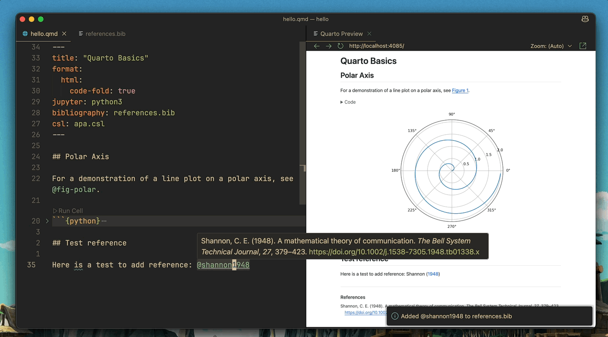

# VSCode Zotero

An extension to insert reference from Zotero library and add them to a bib file.

## The problems
Currently available Zotero extensions for VSCode are not useful for inserting citations from Zotero library. They either:

- Rely on Zotero's citation picker, which can be slow and aesthetically inconsistent with VSCode.
- Require you to first export your Zotero library to a Bibtex file, which is not convenient.
- Require Zotero to be running.
- Do not support `quarto` files.
- Has not been updated for a long time.

Also, the official [Quarto extension for VSCode](https://marketplace.visualstudio.com/items?itemName=quarto.quarto) only supports Zotero citations in visual mode.

## Requirements

- Zotero
- Zotero Better Bibtex

## Features

At the moment, the extension supports `quarto` and `latex` for inserting citation from Zotero library.

### Insert citation (`zotero.searchLibrary`)
(macOS: <kbd>ctrl</kbd> + <kbd>cmd</kbd> + <kbd>r</kbd>, Windows/Linux: <kbd>ctrl</kbd> + <kbd>alt</kbd> + <kbd>r</kbd>).

Items in local Zotero database with Bibtex citation key will be shown in Quick Picks.

If you sellect an item, it will automatically add to `*.bib` file of your project. The extension searches `*.bib` file in the following order:

1. `*.bib` file in `quarto` or `latex` file header (for quarto, this includes `_quarto.yml`)
1. `bibliography.bib` or `references.bib` file in the workspace root directory
1. Any `*.bib` file i the workspace root directory.
1. If none of above is available, ask user to provide path.

### Open PDF/Zotero entry/DOI of citation item under cursor (`zotero.openItem`)
(macOS: <kbd>ctrl</kbd> + <kbd>cmd</kbd> + <kbd>o</kbd>, Windows/Linux: <kbd>ctrl</kbd> + <kbd>alt</kbd> + <kbd>o</kbd>).

For any citations that were inserted using this extension, you can:

1. PDF file of the item using Zotero PDF viewer.
1. Open and show the item in Zotero library
1. Open DOI link using the default browser

## Extension Settings

* `zotero.zoteroDbPath`: Path to Zotero database file (default: `~/Zotero/zotero.sqlite`).
* `zotero.betterBibtexDbPath`: Path to Better BibTex database file (default: `~/Zotero/better-bibtex.sqlite`).

## Release Notes

See [CHANGELOG.md](CHANGELOG.md)

## Todo

- [ ] Performance optimization
- [ ] Rewrite `.bib` reader/writer so that it does not require Better Bibtex database.

## Notes

This extension began as a fork of [telescope-zotero.nvim](https://github.com/jmbuhr/telescope-zotero.nvim), which is an excellent Zotero extension using Neovim to edit `quarto` documents. The only reason kept me from migrating to VSCode for editing `quarto` documents was the lack of a good Zotero extension.

The code is heavily inspired by it, but rewritten in TypeScript for VSCode. I do not speak TypeScript, so I drafted the code using Claude and manually fixed the code to make it work. Hence, if you think I did something wrong, you're probably right.

Has not been tested on Windows or linux. If you find any issues, please let me know.